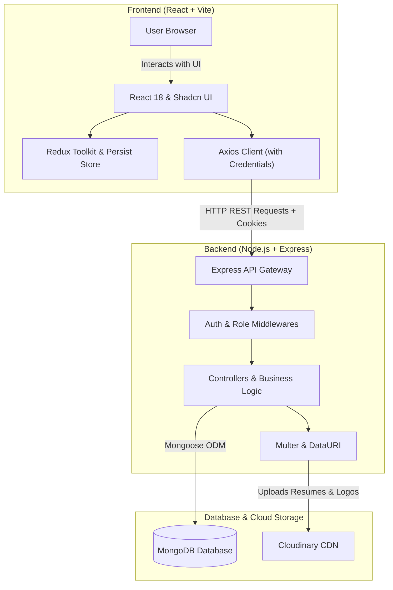

# 💼 HireHub - Full-Stack Job Portal Application

<p align="center">
  
  
  
  
  
  
  
  
</p>

---

## 📌 Overview

**HireHub** is a modern, responsive, full-stack **MERN** (MongoDB, Express.js, React, Node.js) web application engineered to bridge the gap between job seekers (students/candidates) and recruiters (employers/companies). 

Built with state-of-the-art web technologies, HireHub delivers a seamless hiring lifecycle: from candidate job discovery, real-time filtering, and one-click applications to recruiter company onboarding, job vacancy distribution, candidate resume reviews, and status management.

---

## ✨ Key Features

### 👨‍🎓 Candidate / Job Seeker Experience
- **Interactive Landing Page**: Modern hero section with instant search, category carousels, and latest job openings.
- **Advanced Job Discovery**: Browse and filter jobs dynamically by **Location**, **Industry / Technology**, and **Salary Range**.
- **Detailed Job Overview**: View comprehensive job descriptions, company profiles, requirements, salary packages, experience criteria, open vacancies, and applicant counts.
- **One-Click Application**: Apply directly with resume and profile data, with duplicate application protection.
- **Candidate Profile Management**:
  - Update personal information, bio, contact details, and technical skill badges.
  - Upload profile avatars and resume documents (PDF) securely hosted on Cloudinary.
- **Application Tracking Dashboard**: Monitor all applied jobs with real-time status indicators (`Pending`, `Accepted`, or `Rejected`).

### 🏢 Recruiter & Admin Suite
- **Company Profile Setup & Management**:
  - Register company profiles with company name, website URL, location, description, and official brand logos.
  - Search and filter registered companies in real-time.
- **Job Posting & Lifecycle Management**:
  - Create and publish job openings with title, role requirements, experience level, salary, location, job type, and vacancy count.
  - Dedicated Recruiter Dashboard to review and manage all created job listings.
- **Applicant Review & Decision Pipeline**:
  - View applicant pools for every posted job.
  - Inspect candidate profiles, skills, and direct download/preview links for submitted resumes.
  - Update candidate application status (`Accepted` / `Rejected`) with instant feedback.

### 🛡️ Core Platform & Security Features
- **Role-Based Access Control (RBAC)**: Distinct permissions for `student` and `recruiter` accounts.
- **Secure Authentication**: Password hashing using **bcryptjs** and session management via signed **JWT tokens stored in HttpOnly cookies**.
- **Protected Routing**: Client-side protected route guards preventing unauthorized access to admin/recruiter modules.
- **State Persistence**: Global state powered by **Redux Toolkit** and persisted across browser reloads via **Redux Persist**.
- **Cloud Media Uploads**: Fast, reliable storage for resumes, user avatars, and company logos using **Multer + Cloudinary**.

---

## 🏗️ Architecture & Workflow



---

## 💻 Tech Stack

### Frontend
- **Framework & Tooling**: [React 18](https://react.dev/), [Vite](https://vitejs.dev/)
- **Styling & UI**: [Tailwind CSS](https://tailwindcss.com/), [Shadcn UI](https://ui.shadcn.com/) (Radix UI primitives)
- **State Management**: [Redux Toolkit](https://redux-toolkit.js.org/), [Redux Persist](https://github.com/rt2zz/redux-persist)
- **Routing**: [React Router DOM v6](https://reactrouter.com/)
- **Animations & Interaction**: [Framer Motion](https://www.framer.com/motion/), [Embla Carousel](https://www.embla-carousel.com/)
- **Icons & Feedback**: [Lucide React](https://lucide.dev/), [Sonner Toaster](https://sonner.emilkowal.ski/)
- **HTTP Client**: [Axios](https://axios-http.com/)

### Backend
- **Runtime & Framework**: [Node.js](https://nodejs.org/), [Express.js](https://expressjs.com/)
- **Database & ODM**: [MongoDB](https://www.mongodb.com/), [Mongoose](https://mongoosejs.com/)
- **Authentication**: [JSON Web Tokens (JWT)](https://jwt.io/), [bcryptjs](https://github.com/dcodeIO/bcrypt.js), [cookie-parser](https://github.com/expressjs/cookie-parser)
- **File Uploads & Cloud Media**: [Multer](https://github.com/expressjs/multer), [Cloudinary SDK](https://cloudinary.com/), [Datauri](https://github.com/heldr/datauri)
- **Development**: [Nodemon](https://nodemon.io/), [dotenv](https://github.com/motdotla/dotenv), [CORS](https://github.com/expressjs/cors)

---

## 📂 Project Structure

```text
HIRE HUB/
├── backend/
│   ├── controllers/            # Controller functions for business logic
│   │   ├── application.controller.js
│   │   ├── company.controller.js
│   │   ├── job.controller.js
│   │   └── user.controller.js
│   ├── middlewares/            # Custom express middlewares
│   │   ├── isAuthenticated.js  # JWT token verification
│   │   └── mutler.js           # Multer memory storage config
│   ├── models/                 # Mongoose data schemas
│   │   ├── application.model.js
│   │   ├── company.model.js
│   │   ├── job.model.js
│   │   └── user.model.js
│   ├── routes/                 # Express API route endpoints
│   │   ├── application.route.js
│   │   ├── company.route.js
│   │   ├── job.route.js
│   │   └── user.route.js
│   ├── utils/                  # DB connection and Cloudinary data URI helpers
│   │   ├── cloudinary.js
│   │   ├── datauri.js
│   │   └── db.js
│   ├── .env                    # Environment variables (private)
│   ├── index.js                # Express app entrypoint & server bootstrap
│   └── package.json            # Backend dependencies & scripts
│
├── frontend/
│   ├── public/                 # Static public assets
│   ├── src/
│   │   ├── assets/             # Images and design assets
│   │   ├── components/
│   │   │   ├── admin/          # Recruiter/Admin pages & management tables
│   │   │   ├── auth/           # Login & Signup forms with role selection
│   │   │   ├── shared/         # Navbar, Footer, and global shared components
│   │   │   ├── ui/             # Radix & Shadcn reusable UI components
│   │   │   ├── Home.jsx        # Landing page with hero, carousels & latest jobs
│   │   │   ├── Jobs.jsx        # Job listing page with filter sidebar
│   │   │   ├── JobDescription.jsx # Detailed job page & application trigger
│   │   │   ├── Browse.jsx      # Keyword-based job search results
│   │   │   └── Profile.jsx     # Candidate profile, skill badges & applied jobs
│   │   ├── hooks/              # Custom React hooks for data fetching
│   │   ├── redux/              # Redux slices (auth, job, company, application)
│   │   ├── utils/              # API constants & endpoints config
│   │   ├── App.jsx             # React Router route definitions
│   │   ├── main.jsx            # React root with Redux & Persist Providers
│   │   └── index.css           # Tailwind CSS directives & global variables
│   ├── tailwind.config.js      # Tailwind configuration & design tokens
│   ├── vite.config.js          # Vite build tool config
│   └── package.json            # Frontend dependencies & scripts
│
└── README.md                   # Project documentation
```

---

## 🔌 API Endpoints Reference

### 🔐 User & Authentication (`/api/v1/user`)
| Method | Endpoint | Description | Protected |
|---|---|---|:---:|
| `POST` | `/register` | Register a new account (`student` or `recruiter`) with profile picture | ❌ |
| `POST` | `/login` | Authenticate user & issue signed JWT cookie | ❌ |
| `GET` | `/logout` | Clear auth cookie and terminate session | ❌ |
| `POST` | `/profile/update` | Update candidate bio, skills, profile photo, and resume document | ✅ |

### 🏢 Company Management (`/api/v1/company`)
| Method | Endpoint | Description | Protected |
|---|---|---|:---:|
| `POST` | `/register` | Register a new company entity | ✅ |
| `GET` | `/get` | Fetch all companies created by logged-in recruiter | ✅ |
| `GET` | `/get/:id` | Fetch specific company details by ID | ✅ |
| `PUT` | `/update/:id` | Update company information, location, website & brand logo | ✅ |

### 💼 Job Operations (`/api/v1/job`)
| Method | Endpoint | Description | Protected |
|---|---|---|:---:|
| `POST` | `/post` | Create a new job vacancy under a company | ✅ |
| `GET` | `/get` | Get all active jobs (supports keyword search query `?keyword=`) | ✅ |
| `GET` | `/getadminjobs` | Get all jobs posted by the logged-in recruiter | ✅ |
| `GET` | `/get/:id` | Get comprehensive details of a specific job | ✅ |

### 📝 Job Applications (`/api/v1/application`)
| Method | Endpoint | Description | Protected |
|---|---|---|:---:|
| `GET` | `/apply/:id` | Submit an application for a specific job | ✅ |
| `GET` | `/get` | Fetch all applications submitted by candidate | ✅ |
| `GET` | `/:id/applicants` | Fetch list of candidates applied for a job | ✅ |
| `POST` | `/status/:id/update` | Update application status (`pending`, `accepted`, `rejected`) | ✅ |

---

## 🗄️ Database Models

- **User**: Name, Email, Phone Number, Password (hashed), Role (`student` | `recruiter`), Profile (Bio, Skills, Resume URL & Original Name, Profile Photo, Company Reference).
- **Company**: Name (unique), Description, Website, Location, Brand Logo URL, Recruiter User ID reference.
- **Job**: Title, Description, Requirements (array), Salary, Experience Level, Location, Job Type, Positions, Company Reference, Creator Reference, Applications Reference List.
- **Application**: Job Reference, Applicant User Reference, Status (`pending` | `accepted` | `rejected`).

---

## 🚀 Getting Started

Follow the steps below to set up and run the project locally on your machine.

### Prerequisites
Make sure you have installed:
- [Node.js](https://nodejs.org/) (v16.x or later recommended)
- [npm](https://www.npmjs.com/) or [yarn](https://yarnpkg.com/)
- [MongoDB](https://www.mongodb.com/) (Local instance running or MongoDB Atlas connection URI)
- A free [Cloudinary](https://cloudinary.com/) account for image and resume file storage

---

### 1. Clone the Repository
```bash
git clone https://github.com/your-username/hire-hub.git
cd "HIRE HUB"
```

---

### 2. Backend Setup

1. Open a terminal and navigate to the `backend` folder:
   ```bash
   cd backend
   ```

2. Install backend dependencies:
   ```bash
   npm install
   ```

3. Configure environment variables:
   Create a `.env` file inside the `backend` directory with the following variables:
   ```env
   # Server Port
   PORT=8000

   # MongoDB Connection String
   MONGO_URI=mongodb://localhost:27017/jobportal
   # Or MongoDB Atlas:
   # MONGO_URI=mongodb+srv://<username>:<password>@cluster0.mongodb.net/hirehub?retryWrites=true&w=majority

   # JSON Web Token Secret
   JWT_SECRET=your_super_secret_random_jwt_key

   # Cloudinary Media Configuration
   CLOUDINARY_CLOUD_NAME=your_cloudinary_cloud_name
   CLOUDINARY_API_KEY=your_cloudinary_api_key
   CLOUDINARY_API_SECRET=your_cloudinary_api_secret
   ```

4. Start the backend development server:
   ```bash
   npm run dev
   ```
   > The server will start on `http://localhost:8000` and connect to MongoDB.

---

### 3. Frontend Setup

1. Open a second terminal and navigate to the `frontend` folder:
   ```bash
   cd frontend
   ```

2. Install frontend dependencies:
   ```bash
   npm install
   ```

3. Ensure backend API endpoint is properly configured in `src/utils/constant.js`:
   ```javascript
   export const USER_API_END_POINT="http://localhost:8000/api/v1/user";
   export const JOB_API_END_POINT="http://localhost:8000/api/v1/job";
   export const APPLICATION_API_END_POINT="http://localhost:8000/api/v1/application";
   export const COMPANY_API_END_POINT="http://localhost:8000/api/v1/company";
   ```

4. Start the Vite frontend development server:
   ```bash
   npm run dev
   ```
   > The application will be accessible at: `http://localhost:5173`

---

## 🧪 Testing the User Flows

### Candidate Workflow
1. Navigate to `http://localhost:5173/signup` and register as a **Student**.
2. Complete your profile under `/profile` by uploading a resume (PDF) and adding technical skills.
3. Browse vacancies on `/jobs`, search by title or location, and view job details on `/description/:id`.
4. Click **Apply Now** and check your application status in the **Applied Jobs** table on your profile page.

### Recruiter Workflow
1. Register a new account selecting the **Recruiter** role.
2. Go to the Admin navigation tab -> **Companies** (`/admin/companies`).
3. Click **New Company**, register your company name, and update company details (logo, website, location).
4. Go to **Jobs** (`/admin/jobs`), click **New Jobs**, and fill in the job requirements linked to your registered company.
5. In the Jobs table, click on the options menu for a job to view **Applicants** (`/admin/jobs/:id/applicants`).
6. Review applicant resumes and toggle their status to **Accepted** or **Rejected**.

---

## 🛡️ Security Best Practices Implemented
- **Password Security**: Passwords are never stored in plain text; salted and hashed via `bcryptjs`.
- **HttpOnly Cookies**: Prevents XSS-based token theft by storing JWT credentials in an HttpOnly cookie.
- **Data Sanitization**: Mongoose schemas enforce data integrity, unique email checks, and strict enum values.
- **Authenticated Endpoints**: Every sensitive action (posting jobs, viewing applicants, applying) passes through `isAuthenticated` middleware.

---

## 🔮 Future Enhancements
- [ ] In-app messaging and real-time chat between recruiters and candidates via Socket.io.
- [ ] Email notifications on application status updates using Nodemailer / SendGrid.
- [ ] Automated AI resume parser to extract skills and match candidate score against job requirements.
- [ ] Bookmark / Saved jobs functionality for candidates.
- [ ] Dark / Light mode toggle.

---

## 🎓 Academic / Project Attribution
- **Project Name**: HireHub - Job Portal
- **Purpose**: Academic / Capstone College Project
- **Architecture**: MERN Stack (MongoDB, Express, React, Node.js)
- **Contributors**: Developed with passion by the Project Team.

---

## 📄 License
This project is licensed under the [ISC License](LICENSE) - free for academic and learning purposes.
